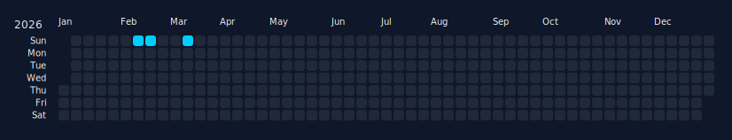
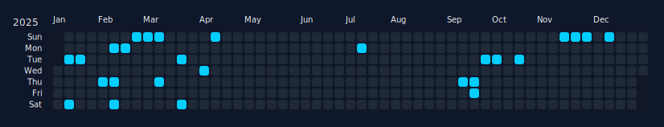
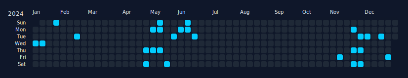
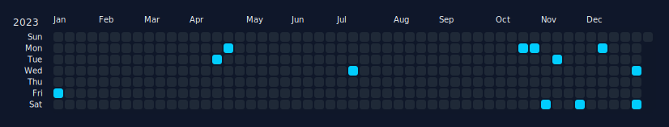
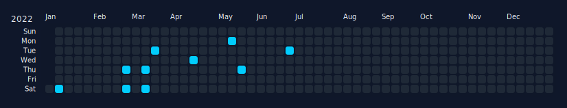
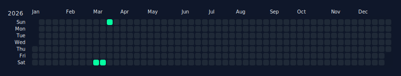
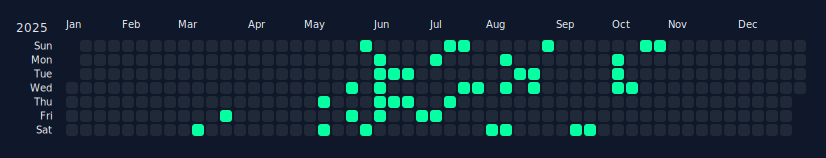
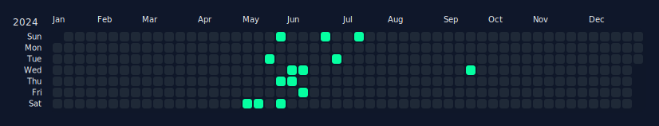
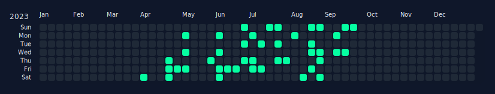
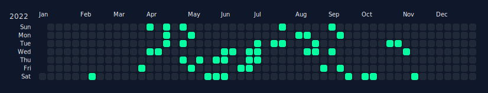

# Workout -> GitHub Heatmap

Sync Strava activities, normalize and aggregate them, and generate GitHub-style calendar heatmaps (SVG) per workout type/year. The heatmaps are embedded in this README and optionally rendered on a GitHub Pages site.

## Quick start

1. Install deps:

```bash
python -m venv .venv
source .venv/bin/activate
pip install -r requirements.txt
```

2. Add your Strava credentials to `config.local.yaml` (this file is ignored by git):

```yaml
strava:
  client_id: "YOUR_CLIENT_ID"
  client_secret: "YOUR_CLIENT_SECRET"
  refresh_token: "YOUR_REFRESH_TOKEN"
```

3. Run the pipeline:

```bash
python scripts/run_pipeline.py --commit
```

This will:
- sync raw activities into `activities/raw/`
- normalize into `data/activities_normalized.json`
- aggregate into `data/daily_aggregates.json`
- generate SVGs in `heatmaps/`
- update the README heatmap section
- build `site/data.json`
- commit the changes (one commit per run)

## Configuration

Base settings live in `config.yaml`. Put secrets in `config.local.yaml`.

Key options:
- `sync.lookback_years` (default 5)
- `activities.types` (activity types to include)
- `activities.type_aliases` (map Strava types to your canonical types)
- `units.distance` (`mi` or `km`)
- `units.elevation` (`ft` or `m`)
- `rate_limits.*` (free Strava API throttling caps)

## GitHub Actions (optional)

Add secrets to your repo:
- `STRAVA_CLIENT_ID`
- `STRAVA_CLIENT_SECRET`
- `STRAVA_REFRESH_TOKEN`

Then enable the scheduled workflow in `.github/workflows/sync.yml`.

## Notes

- `activities/raw/` contains raw Strava payloads. Keep or prune based on your privacy needs.
- SVGs are deterministic and contain `<title>` tooltips for hover details.
- README updates automatically between `<!-- HEATMAPS:START -->` and `<!-- HEATMAPS:END -->`.
- The sync script rate-limits to free Strava API caps (100 read / 15 min, 1,000 read daily). Initial backfill may take multiple days; re-run the pipeline until complete.

<!-- HEATMAPS:START -->
## Heatmaps

### Run







### Ride







### StrengthTraining


<!-- HEATMAPS:END -->
