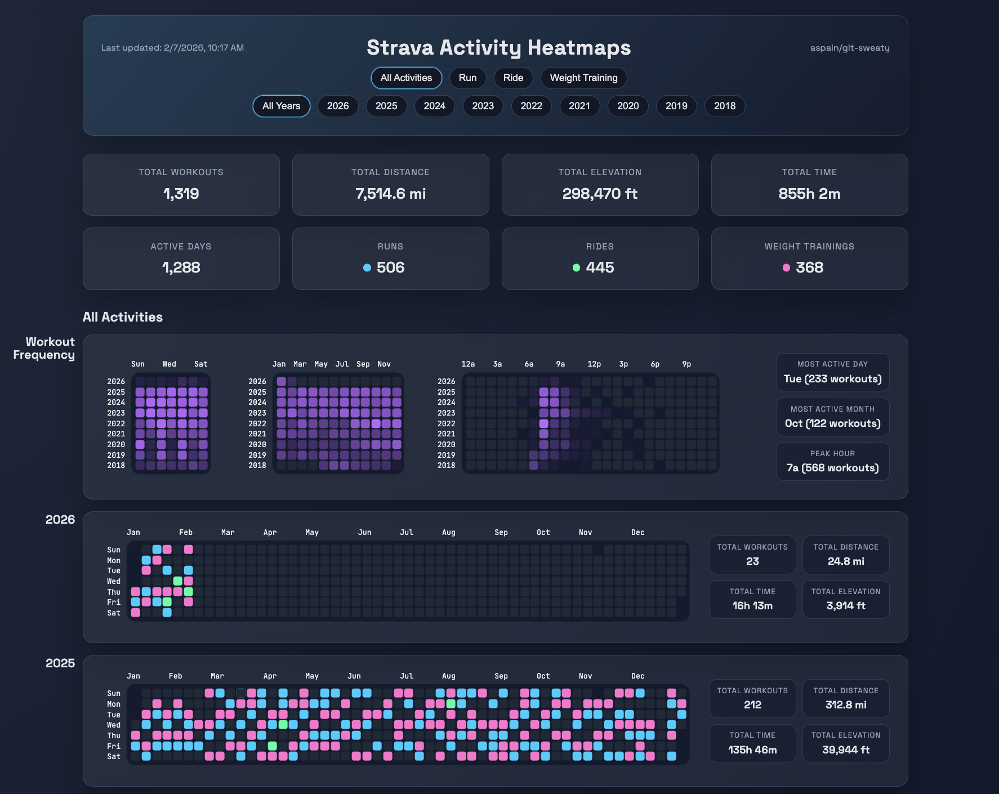

# Workout --> GitHub Heatmap Dashboard

Sync Strava activities, normalize and aggregate them, and generate GitHub-style heatmaps per workout type/year. Populates an interactive, free GitHub Pages–hosted dashboard, automatically refreshed daily.

- View the Interactive [Activity Dashboard](https://aspain.github.io/git-sweaty/)
- Once setup is complete, this dashboard link will automatically update to your own GitHub Pages URL.

<!-- HEATMAPS:START -->
Preview:


<!-- HEATMAPS:END -->

## Quick Start

No local clone is required for this setup. You can run everything from GitHub Actions. Clone locally only if you want to customize or run the scripts yourself.

1. Fork this repo to your account: [Fork this repository](../../fork)

2. Create a Strava API application at [Strava API Settings](https://www.strava.com/settings/api). Set **Authorization Callback Domain** to `localhost`, then copy:
   - `STRAVA_CLIENT_ID`
   - `STRAVA_CLIENT_SECRET`

3. Generate a **refresh token** via OAuth (the token shown on the Strava API page often does **not** work).
   Open this URL in your browser (replace `CLIENT_ID` with the Client ID value from your Strava API application page):

   ```text
   https://www.strava.com/oauth/authorize?client_id=CLIENT_ID&response_type=code&redirect_uri=http://localhost/exchange_token&approval_prompt=force&scope=read,activity:read_all
   ```

   After approval you’ll be redirected to a `localhost` URL that won’t load. That’s expected.
   Example redirect URL:

   ```text
   http://localhost/exchange_token?state=&code=12345&scope=read,activity:read_all
   ```

   Copy the value of the `code` query parameter from the failed URL (in this example, `12345`) and exchange it.
   Run this command in a terminal app (macOS/Linux Terminal, or Windows PowerShell/Command Prompt).
   Use the `CLIENT_ID` and `CLIENT_SECRET` values from your Strava API application page in Step 2.

   ```bash
   curl -X POST https://www.strava.com/oauth/token \
     -d client_id=CLIENT_ID \
     -d client_secret=CLIENT_SECRET \
     -d code=THE_CODE_FROM_THE_URL \
     -d grant_type=authorization_code
   ```

   Copy the `refresh_token` from the response.

4. Add GitHub secrets (repo → [Settings → Secrets and variables → Actions](../../settings/secrets/actions)):
   - `STRAVA_CLIENT_ID`
   - `STRAVA_CLIENT_SECRET`
   - `STRAVA_REFRESH_TOKEN` (from the OAuth exchange above)

5. Enable GitHub Pages (repo → [Settings → Pages](../../settings/pages)):
   - Under **Build and deployment**, set **Source** to **GitHub Actions**.

6. Run [Sync Strava Heatmaps](../../actions/workflows/sync.yml):
   - If GitHub shows an **Enable workflows** button in [Actions](../../actions), click it first.
   - Go to [Actions](../../actions) → [Sync Strava Heatmaps](../../actions/workflows/sync.yml) → **Run workflow**.
   - The same workflow is also scheduled in `.github/workflows/sync.yml` (daily at `06:00 UTC`).

7. Open your live site at `https://<your-username>.github.io/<repo-name>/` after deploy finishes.
   This workflow will:
   - sync raw activities into `activities/raw/` (local-only; not committed)
   - normalize + merge into `data/activities_normalized.json` (persisted history)
   - aggregate into `data/daily_aggregates.json`
   - generate SVGs in `heatmaps/`
   - build `site/data.json`

## Activity Type Note

By default, all Strava activity types are included automatically when you run the workflow.

To narrow the dashboard to specific activity types:
1. Edit [`config.yaml`](config.yaml) in your fork.
2. Set `activities.include_all_types: false`.
3. Set `activities.types` to only the types you want.
4. Run [Sync Strava Heatmaps](../../actions/workflows/sync.yml) again.

Example:

```yaml
activities:
  include_all_types: false
  types:
    - Run
    - Ride
    - WeightTraining
```

## Configuration (Optional)

Everything in this section is optional. Defaults work without changes.
Base settings live in `config.yaml`.

Key options:
- `sync.start_date` (optional `YYYY-MM-DD` lower bound for history)
- `sync.lookback_years` (optional rolling lower bound; used only when `sync.start_date` is unset)
- `sync.recent_days` (sync recent activities even while backfilling)
- `sync.resume_backfill` (persist cursor to continue older pages across days)
- `activities.types` (featured activity types shown first in UI)
- `activities.include_all_types` (include non-featured Strava types; default `true`)
- `activities.group_other_types` (auto-group non-featured types into smart categories)
- `activities.other_bucket` (fallback group name when no smart match is found)
- `activities.group_aliases` (optional explicit map of a raw/canonical type to a group)
- `activities.type_aliases` (map Strava types to your canonical types before grouping)
- `units.distance` (`mi` or `km`)
- `units.elevation` (`ft` or `m`)
- `rate_limits.*` (free Strava API throttling caps)

## Notes

- Raw activities are stored locally for processing but are not committed (`activities/raw/` is ignored). This prevents publishing detailed per‑activity payloads and gps location traces.
- If neither `sync.start_date` nor `sync.lookback_years` is set, sync backfills all available Strava history.
- On first run for a new athlete, the workflow auto-resets persisted outputs (`data/*.json`, `heatmaps/`, `site/data.json`) to avoid mixing data across forks. A fingerprint-only file is stored at `data/athletes.json` and does not include athlete IDs or profile data.
- The sync script rate-limits to free Strava API caps (200 overall / 15 min, 2,000 overall daily; 100 read / 15 min, 1,000 read daily). The cursor is stored in `data/backfill_state.json` and resumes automatically. Once backfill is complete, only the recent sync runs.
- The GitHub Pages site is optimized for responsive desktop/mobile viewing.
